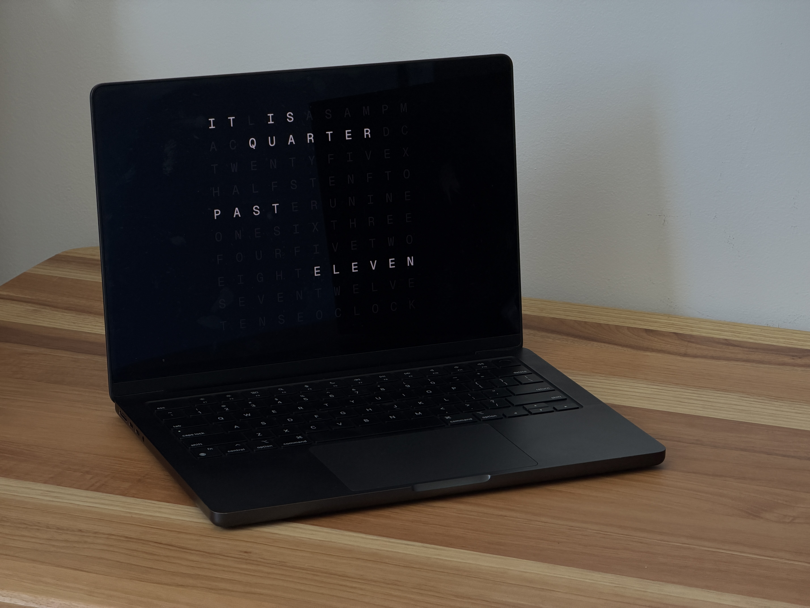

# WordSaver

A word clock screensaver for macOS, inspired by QLOCKTWO.

Displays the current time as illuminated words on a typographic grid. Built with React + TypeScript, wrapped in a native macOS screensaver.



## Install

1. Download `WordSaver.saver.zip` from the [latest release](https://github.com/danielcspaiva/word-saver/releases/latest)
2. Extract and double-click `WordSaver.saver`
3. Choose "Install for this user"
4. Open **System Settings → Screen Saver** and select **WordSaver**

## Build from source

Requires [Bun](https://bun.sh) and Xcode Command Line Tools.

```bash
git clone https://github.com/danielcspaiva/word-saver.git
cd word-saver
bun install
./apps/screensaver/scripts/build.sh
```

The screensaver will be built and installed to `~/Library/Screen Savers/`.

## How it works

The clock resolves the current time into English phrases at 5-minute intervals:

- **7:00** → IT IS SEVEN O'CLOCK
- **7:15** → IT IS QUARTER PAST SEVEN
- **7:30** → IT IS HALF PAST SEVEN
- **7:45** → IT IS QUARTER TO EIGHT

A 10x11 letter grid contains all the words needed. Active letters glow white; inactive letters fade into the background.

## Architecture

```
core/time/    → Pure TS time-to-words engine (no UI deps)
core/layout/  → Grid definition + cell resolution
components/   → React rendering (CSS Grid + transitions)
screensaver/  → Swift ScreenSaverView + WKWebView wrapper
```

## Inspiration

Inspired by [QLOCKTWO](https://qlocktwo.com) by Biegert & Funk — a beautifully designed word clock that displays time in words. This project is an independent, open-source homage and is not affiliated with or endorsed by Biegert & Funk.

## License

MIT
